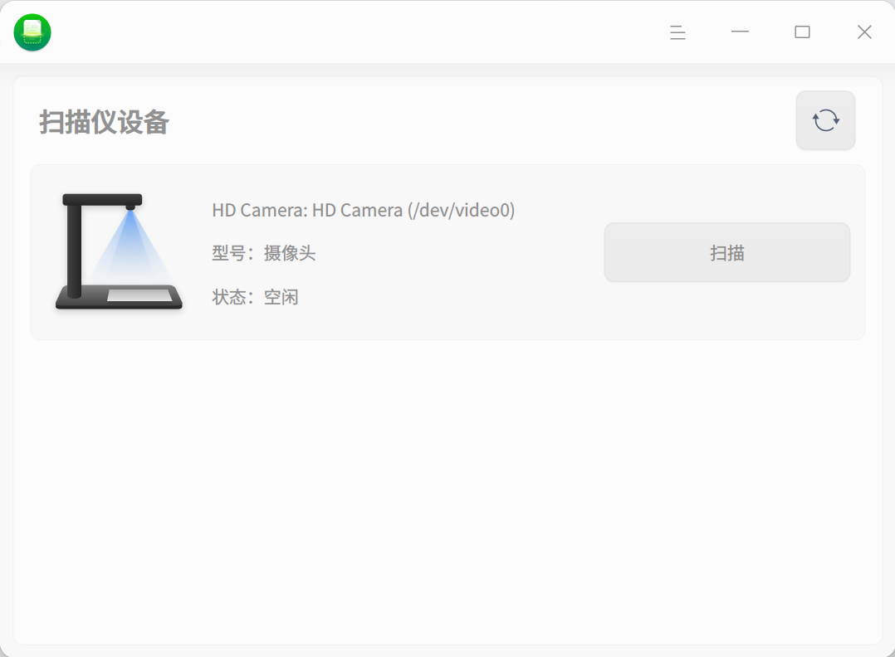

# 扫描管理器|deepin-scanner|

## 概述

扫描管理器是一款管理扫描设备的工具，可同时管理多个扫描设备。页面可视化，操作简单。

## 使用入门

您可以通过以下方式运行或关闭扫描管理器，或者创建快捷方式。

### 运行扫描管理器

1. 单击任务栏上的启动器图标 ，进入启动器页面。
2. 上下滚动鼠标滚轮浏览或通过搜索，找到扫描管理器图标  ，单击运行。
3. 右键单击 ，您可以：
   
    - 单击 **发送到桌面**，在桌面创建快捷方式。
      
    - 单击 **发送到任务栏**，将应用程序固定到任务栏。
      
    - 单击 **开机自动启动**，将应用程序添加到开机启动项，在电脑开机时自动运行该应用程序。
      

### 关闭扫描管理器

- 在扫描管理器页面单击  ，退出扫描管理器。
- 右键单击任务栏上的 ，选择 **关闭所有** 来退出扫描管理器。
- 在扫描管理器页面单击  ，选择 **退出** 来退出扫描管理器。

## 扫描操作介绍

将扫描设备与电脑连接，并打开扫描设备的开关。

打开扫描管理器，系统会自动扫描当前电脑上连接的所有扫描设备，如拍摄仪和扫描仪。如果没有显示对应的设备列表，则需要安装驱动。

### 安装驱动

1. 在官网下载扫描设备对应的.deb驱动安装包。
2. 双击驱动安装包，软件包安装器会自动启动并准备安装该软件包。
3. 驱动安装成功后，单击刷新按钮确认设备显示在列表中。

### 拍摄仪

1. 在设备列表中选择拍摄仪并单击 **扫描**，进入扫描页面。
   
2. 在页面右侧设置扫描参数，包括扫描设置、裁剪及图像处理方案等。
   
    **扫描设置**：设置扫描图片的分辨率、色彩模式及图片格式。当前支持彩色/灰度/黑白三种色彩模式，支持jpg/bmp/tif/png四种图片格式，且支持扫描为pdf、ofd文档。
    
    
    
    
    
4. 完成设置后，单击扫描按钮，扫描的图片可以在 “查看已扫描图像” 中查看。
   

## 主菜单

在主菜单中，可以切换窗口主题，查看帮助手册等。

### 主题

窗口主题包含浅色主题、深色主题和系统主题。

1. 在扫描管理器页面，单击。
2. 单击 **主题**，选择一个主题颜色。

### 帮助

1. 在扫描管理器页面，单击 。
2. 单击 **帮助**，查看帮助手册，进一步了解和使用扫描管理器。

### 关于

1. 在扫描管理器页面，单击 。
2. 单击 **关于**，查看扫描管理器的版本和介绍。

### 退出

1. 在扫描管理器页面，单击 。
2. 单击 **退出**。